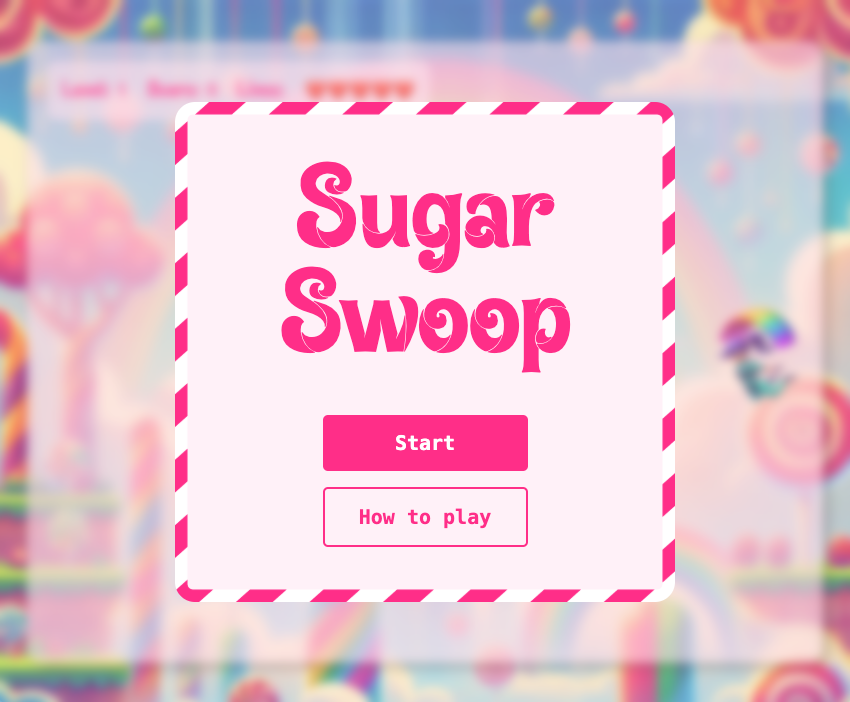
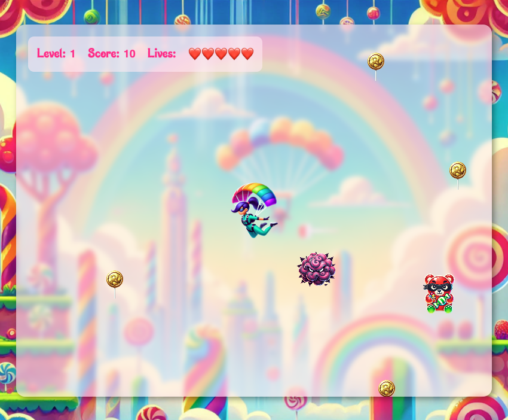

# Sugar Swoop 🍬

[Play the Game Here!](https://karajelley.github.io/sugar-swoop/)

## 🎮 Description

**Sugar Swoop** is a fast-paced, single-player arcade game where you control a sweet, daring character navigating a candy-filled world. Move in all directions, shoot enemies, collect tasty treats for points, and grab hearts to keep your lives intact. Dodge or defeat colorful enemies and see how long you can last in this sugary showdown!

## 💡 Features

- **Character Movement**: Move the player up, down, left, and right.
- **Shooting Mechanism**: Fire peppermint bullets to defeat enemies.
- **Enemies**: Dodge or eliminate enemies like Cotton Candy Clouds and Candy Bandits.
- **Power-ups**: Collect candy coins, lollipop tokens, and candy hearts for points and extra lives.
- **Scoring**: Earn points by collecting candy and additional lives by grabbing hearts.

## 🕹️ Gameplay

- **Objective**: Survive as long as possible while dodging enemies and collecting power-ups.
- **Player Movement**: Control the player to avoid incoming enemies and shoot peppermint bullets.
- **Enemies**: Different types, each with unique effects (slow down the player or take away points/lives).
- **Power-ups**: Collect them to boost your score or gain extra lives.

## ⚙️ Technologies Used

- **HTML5**: For the structure of the game and rendering the game area.
- **CSS3**: For styling the game layout and creating a visually appealing design.
- **JavaScript**: For game logic, character movement, shooting, and interaction.
- **DOM Manipulation**: To dynamically update the game and interact with HTML elements.
- **GitHub Pages**: For hosting and deploying the game online.

## 🚀 How to Play

1. Click the link above to start the game.
2. Use the arrow keys to move the player.
3. Press the spacebar to shoot peppermint bullets.
4. Collect candy for points and hearts for extra lives.
5. Dodge or shoot the enemies to avoid losing lives.

## 📬 Contact

You can reach me at [karajelley@gmail.com](mailto:karajelley@gmail.com) for any inquiries or feedback.

## Screenshots

  
  

